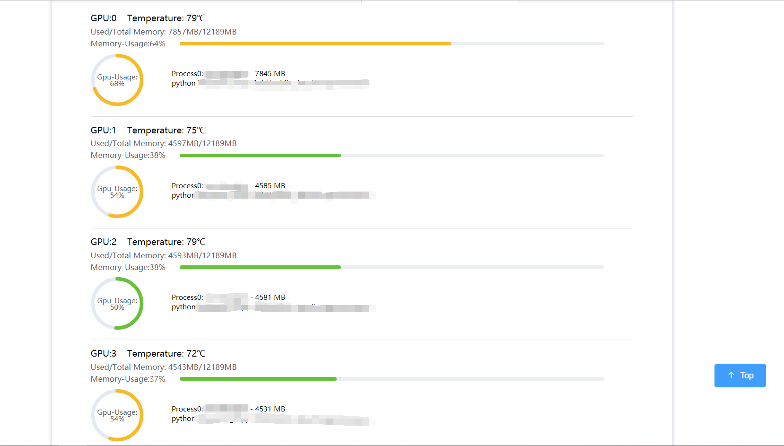

<p align="center">
  
</p>

# 集群GPU状态监管工具 
采用Python-Flask框架编写，可以非常快速简单地部署在服务器上。
服务核心将在设定好的时间间隔，通过ssh服务拉取目标客户机上的GPU状态，确保目标机可以使用nvidia-smi命令即可。
##### 第一步：
请参考server-example.json在app.py同级目录创建文件server.json。
将需要监控的服务器配置添加到server.js中。
##### 第二步：
开启服务：
```
python app.py
```
##### 第三步：
访问http://127.0.0.0:9001/smile或http://0.0.0.0:9001/smile，即可进入页面。
服务中有抓取CPU和内存使用量的命令，但没有直接加入到统计信息中，这里仅包含了GPU的信息。


# GPU Clusters Status Monitoring Tool
This is a gpu clusters status monitoring tool by using Flask, which is a microframework for Python. And you can deploy very quickly and easily on the server.

The service core will pull the GPU state on the target client through the ssh service at the set interval, ensuring that the target machine can use the nvidia-smi command.
##### Step 1:
Please refer to server-example.json to create the file server.json in the app.py directory.
Add the server configuration that needs to be monitored into server.js.

##### Step 2:
Start web server:
```
python app.py
```

##### Step 3:
Browser http://127.0.0.0:9001/smile or http://0.0.0.0:9001/smile to see the page.
The service has commands to grab CPU and memory usage, but it is not directly added to the statistics. Only the GPU information is included here.

